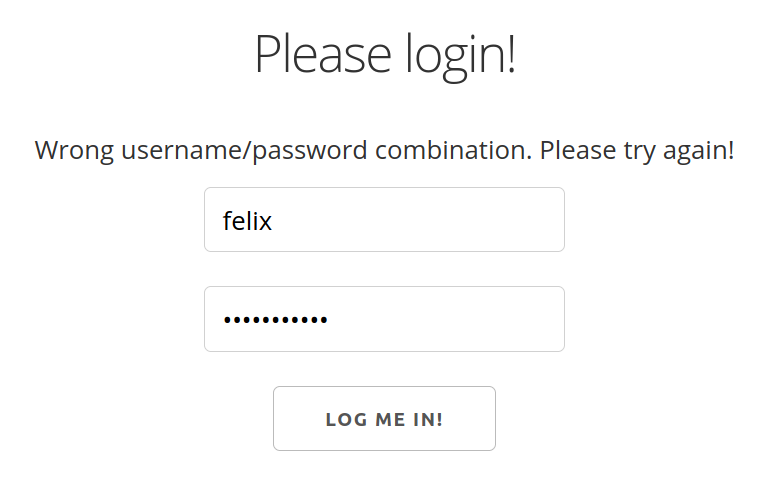
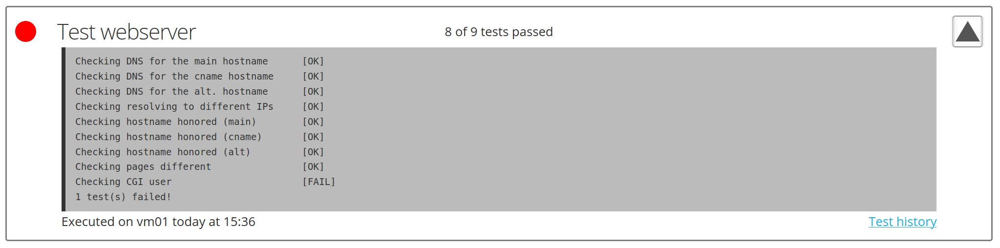

# Status monitor

## Features

- Full-fledged user authentication
  - Users can inspect test results, etc.
  - Admins can run tests outside of schedule and add new users
  
  
- Overview pages like one showing all VMs

  
- Pages with details like full test script output or test history

  

- Ability to view next scheduled test run and run tests outside of that schedule (latter is admins only)

## Installation

During the following we consider two users, `root` and `dash-user`. This is due to `test_runner.py` needing access to SSH keys accessing `root` on all VMs, while the main application does not need any special permissions. In our setup we therefore have two different users running the respective components. You are free to use just one user, simply run all the following commands with that user.

We will need a base installation of python (version 3.7 or higher), a git client and some packages required by the python packages below:

```bash
root@server$ apt install git python3.7 python3-pip python3.7-dev libssl-dev libffi-dev
```

Python packages for dash framework, database communication and password hashing:

```bash
dash-user@server$ python3.7 -m pip install --upgrade dash PyMySQL bcrypt
root@server$ python3.7 -m pip install --upgrade PyMySQL bcrypt
```

Then we can clone (or download) this repository:

```bash
dash-user@server$ git clone git@github.com:FelixRech/status-monitor.git
```

After editing the configuration in `components/config.py` to configure database and where to bind to. Now, we are ready to run everything:

```bash
dash-user@server$ python3.7 index.py
root@server$ python3.7 test_runner.py
```
